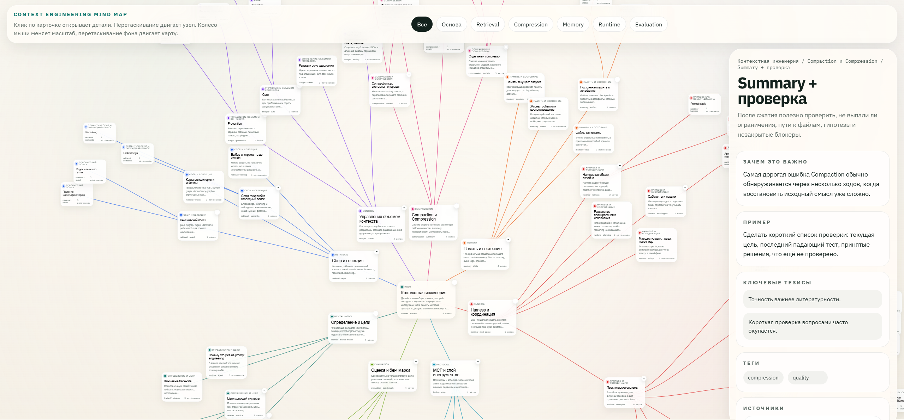

# Context Engineering Mindmap

Интерактивная mind map по контекстной инженерии для LLM-агентов и coding workflows.

Демо: https://safreliy.github.io/context-engineering-mindmap/

## Что внутри

- центричная интерактивная карта с раскрытием узлов;
- кластеры по retrieval, budgeting, compaction, memory, orchestration, tooling и evaluation;
- практические примеры реальных агентных систем;
- статическая реализация без сборки: HTML + CSS + JavaScript.

## Файлы

- `index.html` — страница карты;
- `styles.css` — визуальный стиль;
- `app.js` — рендер, взаимодействие, layout;
- `mindmap-data.js` — данные карты, тексты, источники и структура узлов.
